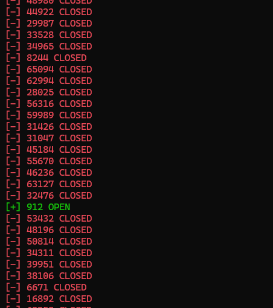
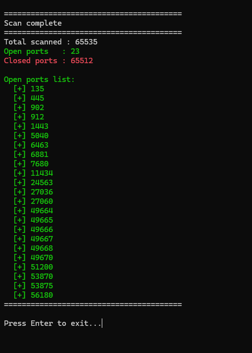

# FlowScan


A fast, multi-threaded TCP port scanner with color-coded output.

---

## 🖥️ Screenshots

**Scan in progress**



**Scan finished**



---

## 🚀 Quick Start

```bash
python flowscan.py
```

## 📋 Requirements

- Python 3.x
- Standard libraries only (`socket`, `threading`, `sys`)

---

## 📊 Features

- scans all **65,535** TCP ports
- runs on **500 threads** for speed
- open ports are shown in 🟢 **green**
- closed ports are shown in 🔴 **red**

---

## 📝 Example Output

```
========================================
FlowScan
========================================
Your local IP: 192.168.1.18
========================================
Target IP: 127.0.0.1

Scanning 127.0.0.1 (1-65535)...

  [+] 135 OPEN
  [-] 136 CLOSED
  ...
========================================
Scan complete
========================================
Total scanned : 65535
[+] Open ports   : 12
[-] Closed ports : 65523
========================================
```
